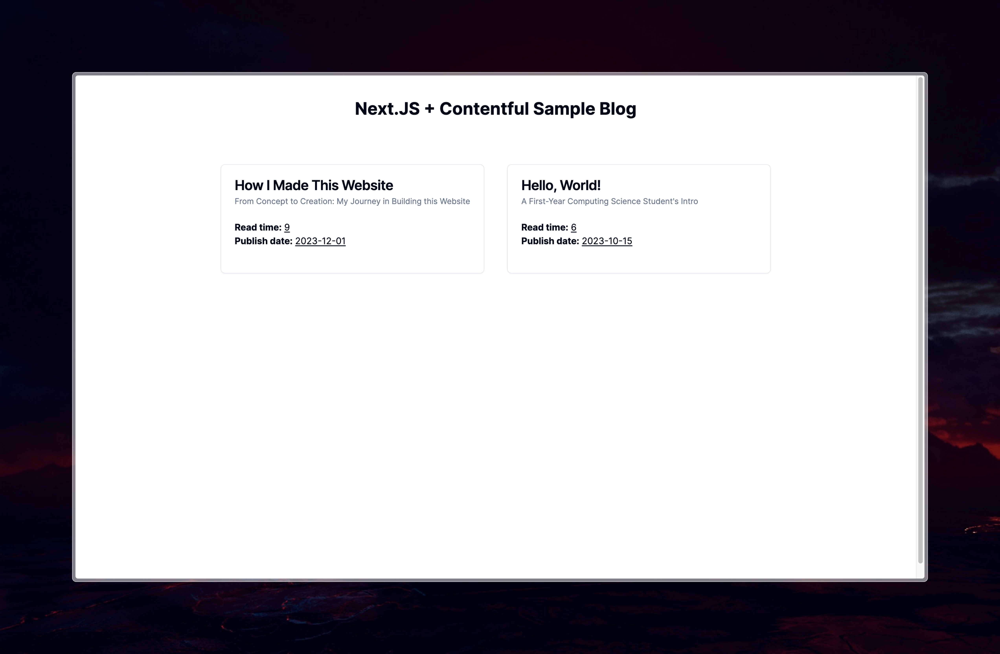
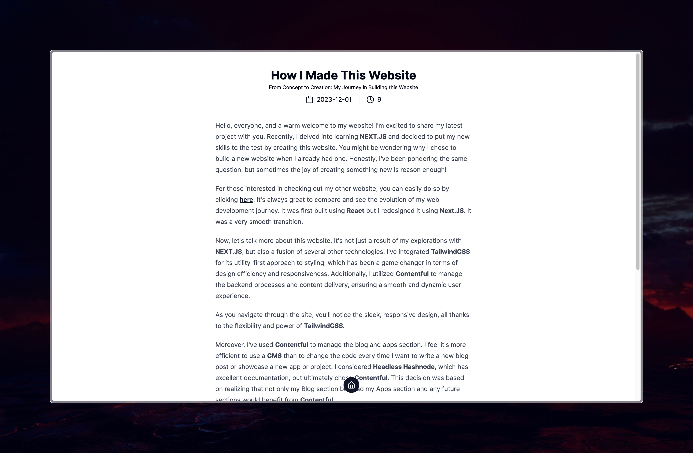

# Next.js & Contentful Sample Blog

*A guide to build a blog using Contentful CMS with Next.js*

### Preview of the sample blog



<hr />

### First of all make a Next.JS, Typescript project

```zsh
npx create-next-app@latest nextjs-contentful-sample-blog --ts
```

Then install Contentful using 

```zsh
npm i contentful
```

Now that Contentful library is installed, make a new file `lib/create-client.ts`, here we configure the contentful client.

```ts
import { ContentfulClientApi, createClient } from "contentful";

export const client: ContentfulClientApi<undefined> = createClient({
    space: process.env.CONTENTFUL_SPACE_ID!,
    accessToken: process.env.CONTENTFUL_CONTENT_DELIVERY_ACCESS_TOKEN!,
});
```

Remember to paste the API Keys in your `.env.local` file. To retreive them open **Contentful** and open `settings > API keys > Add API key`. Here you can copy the **SPACE ID** and the **Content Delivery API - access token**. Paste these in your `.env.local` file.
```
CONTENTFUL_SPACE_ID=********
CONTENTFUL_CONTENT_DELIVERY_ACCESS_TOKEN=***************
```
Now they can be accessed when prefixed with `process.env`
