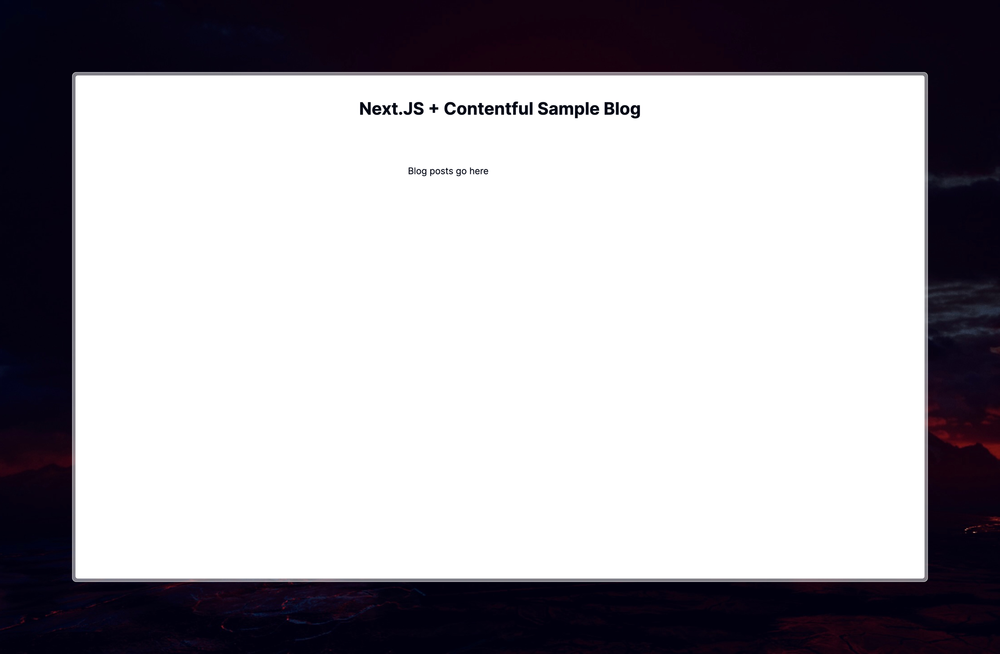

# Next.js & Contentful Sample Blog

*A guide to building a blog using Contentful CMS with Next.js*

### Preview of the sample blog
<!--  -->
<!--  -->

<table>
<td></td>
<td></td>
</table>

<hr />

### First of all make a Next.JS, Typescript project

```zsh
npx create-next-app@latest nextjs-contentful-sample-blog --ts
```

Then install Contentful

```zsh
npm i contentful
```

Now that Contentful library is installed, make a new file `lib/create-client.ts`, now we set up the connection with **Contentful**, in order to retrieve data from our blog.

```ts
import { ContentfulClientApi, createClient } from "contentful";

export const client: ContentfulClientApi<undefined> = createClient({
    space: process.env.CONTENTFUL_SPACE_ID!,
    accessToken: process.env.CONTENTFUL_CONTENT_DELIVERY_ACCESS_TOKEN!,
});
```

Remember to paste the API Keys in your `.env.local` file. To retreive them open **Contentful** and open `settings > API keys > Add API key`. Here you can copy the **SPACE ID** and the **Content Delivery API - access token**. Paste these in your `.env.local` file.
```
CONTENTFUL_SPACE_ID=********
CONTENTFUL_CONTENT_DELIVERY_ACCESS_TOKEN=***************
```
Now the **API keys** can be accessed when prefixed with `process.env`

Now open the `/app/page.tsx` and add this (you can design it any how you want this is just my version)
```tsx
export default async function Home() {

  return (
    <main className="flex min-h-screen flex-col items-center space-y-20 p-10">
      <h1 className="font-bold text-3xl">Next.JS + Contentful Sample Blog</h1>

      <div className="mt-10 grid grid-cols-1 md:grid-cols-2 gap-10">
        <p>Blog posts go here</p>
      </div>
    </main>
  );
}
```



Now before we can access the blog posts you have to fetch the blog entries from **Contentful**.

Create a new file `/lib/get-blog-entries.ts`
```ts
import { client } from "@/lib/create-client";
import { EntryFieldTypes } from "contentful";

export interface BlogPostInterface {
    contentTypeId: "blogPost";
    fields: {
        title: EntryFieldTypes.Text
        subtitle: EntryFieldTypes.Text
        slug: EntryFieldTypes.Text
        publishDate: EntryFieldTypes.Text
        readTime: EntryFieldTypes.Number
        postContent: EntryFieldTypes.RichText
    }
}

export const getBlogEntries = async () => {
    const entries = await client.getEntries<BlogPostInterface>({ content_type: "blogPost" });
    return entries;
}
```

1. **Import Statements**:
   ```ts
   import { client } from "@/lib/create-client";
   import { EntryFieldTypes } from "contentful";
   ```

   - The first import statement imports the `client` object from the `create-client.ts` file located in the `lib` directory. This `client` object is responsible for interacting with the **Contentful API**.
   - The second import statement imports `EntryFieldTypes` from the `contentful` package. This is used to define the types of fields in Contentful entries.

2. **Interface Definition**:
   ```ts
   interface BlogPostInterface {
       contentTypeId: "blogPost";
       fields: {
           title: EntryFieldTypes.Text
           subtitle: EntryFieldTypes.Text
           slug: EntryFieldTypes.Text
           publishDate: EntryFieldTypes.Text
           readTime: EntryFieldTypes.Number
           postContent: EntryFieldTypes.RichText
       }
   }
   ```

   - This defines an interface named `BlogPostInterface` to represent the structure of a blog post entry fetched from Contentful.
   - It includes the following fields:
     - `contentTypeId`: Represents the type ID of the Contentful entry, which should be `"blogPost"`.
     - `fields`: An object containing the fields of the blog post entry, where each field is typed according to its Contentful field type.
       - We make use of `EntryFieldTypes` from **Contentful** so that we are able to access the types provided my **Contentful** like `EntryFieldTypes.RichText` which would be the type for the Blog Post content (written in markdown). The other types are self-explanatory :)

3. **Function Definition**:
   ```ts
   export const getBlogEntries = async () => {
       const entries = await client.getEntries<BlogPostInterface>({ content_type: "blogPost" });
       return entries;
   }
   ```

   - This exports a function named `getBlogEntries` responsible for fetching blog post entries from Contentful.
   - It is an asynchronous function (using `async` keyword) because fetching data from Contentful is an asynchronous operation.
   - Inside the function:
     - It uses the `client` object to call `getEntries`, which fetches entries from Contentful.
     - `<BlogPostInterface>` specifies the type of entries that should be returned, ensuring type safety.
     - `{ content_type: "blogPost" }` specifies the content type of the entries to be fetched, which should be `"blogPost"`.
     - The function returns the fetched entries.

Overall, this code sets up a function to fetch blog post entries from Contentful and ensures type safety by defining an interface to represent the structure of these entries.

Now the blog posts can be fetched from **Contentful**. Open `app/page.tsx`
```tsx
import { Card, CardContent, CardDescription, CardHeader, CardTitle } from "@/components/ui/card";
import { BlogPostInterface, getBlogEntries } from "@/lib/get-blog-entries";
import { Entry } from "contentful";
import Link from "next/link";

export default async function Home() {

  const blogEntries = await getBlogEntries();
  const posts: Entry<BlogPostInterface, undefined, string>[] = blogEntries.items

  return (
    <main className="flex min-h-screen flex-col items-center space-y-20 p-10">
      <h1 className="font-bold text-3xl">Next.JS + Contentful Sample Blog</h1>

      <div className="mt-10 grid grid-cols-1 md:grid-cols-2 gap-10">

        {posts.map((post) => (
          <Link href={`/${post.fields.slug}`} key={post.sys.id} className="">
            <Card className="hover:shadow-xl transition-all duration-300 ease-in-out min-h-[12rem]">
              <CardHeader>
                <CardTitle>{post.fields.title}</CardTitle>
                <CardDescription>{post.fields.subtitle}</CardDescription>
              </CardHeader>
              <CardContent>
                <p><strong>Read time:</strong>  <span className="underline underline-offset-2">{post.fields.readTime}</span></p>
                <p><strong>Publish date:</strong> <span className="underline underline-offset-2">{post.fields.publishDate}</span></p>
              </CardContent>
            </Card>
          </Link>
        ))}

      </div>
    </main>
  );
}
```
Now you should have something that looks like this:

I am making use of Shadcn-UI for the *blog* to look mordern and i can spend less time on *styling* ^0^